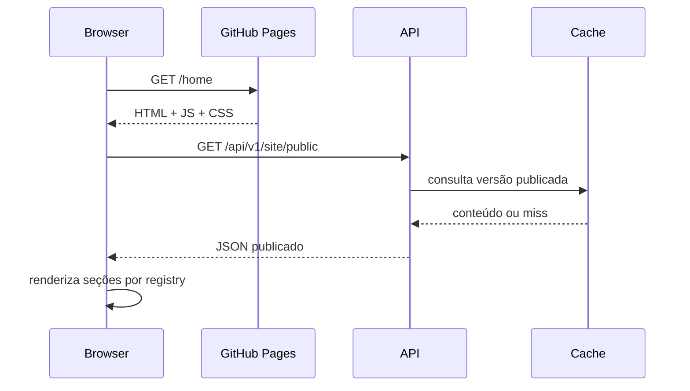
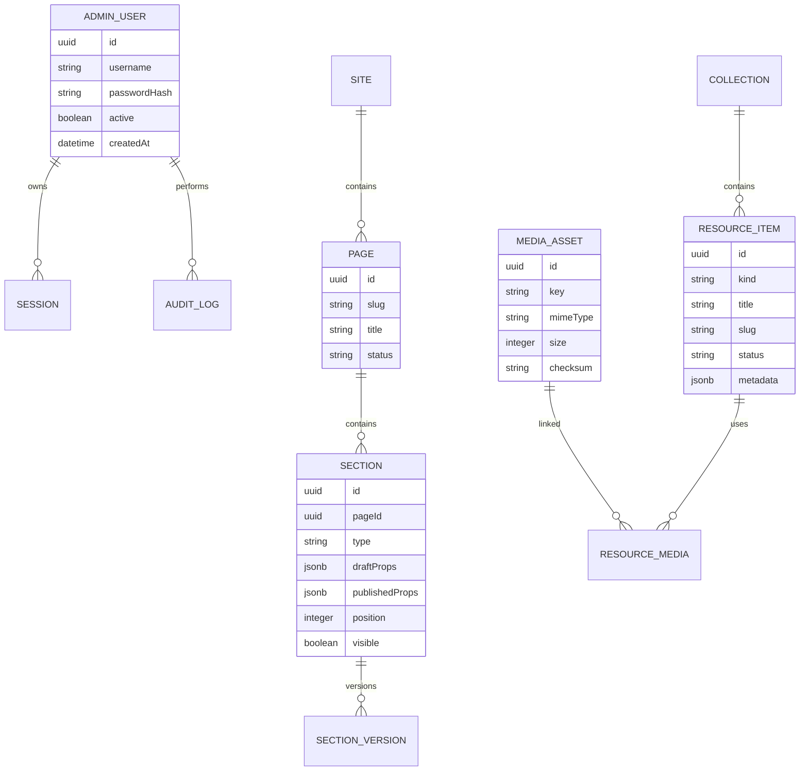
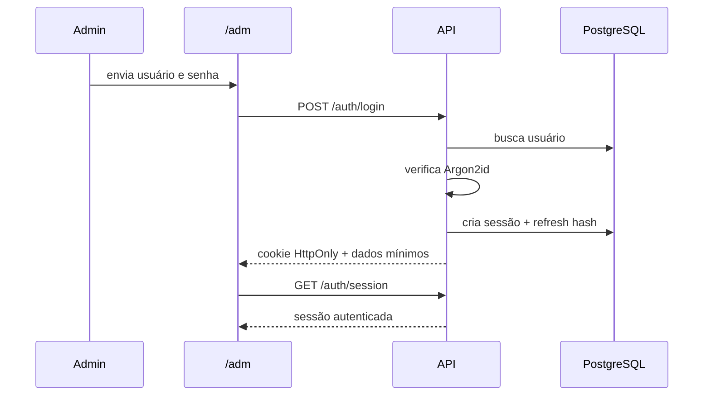
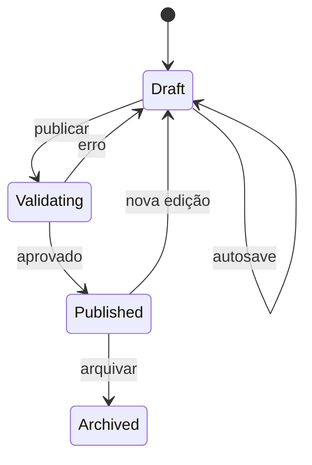

# ARCHITECTURE.md — Arquitetura do Sistema

## 1. Visão geral

O projeto é composto por dois aplicativos e pacotes compartilhados:

1. **Web**: React estático publicado no GitHub Pages.
2. **API**: Node.js executado em infraestrutura externa.
3. **Contracts**: schemas e tipos compartilhados.
4. **Design Tokens**: valores visuais compartilhados.

```mermaid
flowchart LR
  U[Visitante] --> WEB[React / GitHub Pages]
  A[Administrador] --> ADM[/adm React]
  WEB --> API[Node.js API]
  ADM --> API
  API --> DB[(PostgreSQL)]
  API --> STORAGE[(Object Storage)]
  API --> AUDIT[(Audit Log)]
  CI[GitHub Actions] --> WEB
```

## 2. Restrições arquiteturais

### GitHub Pages

O GitHub Pages é hospedagem estática. Ele não executa o backend Node.js. Por isso:

- toda lógica secreta fica na API;
- o frontend recebe apenas variáveis públicas;
- autenticação não é validada localmente;
- uploads passam pela API ou por URL assinada;
- o painel `/adm` é uma interface estática protegida por sessão de servidor.

### Rotas limpas

Para garantir acesso direto a `/home` e `/adm` sem hash:

```text
dist/
├── index.html          # redireciona para /home
├── home/
│   └── index.html      # entrada pública
├── adm/
│   └── index.html      # entrada administrativa
└── assets/
```

O build deve gerar entradas físicas. Não depender exclusivamente de fallback de SPA do servidor.

## 3. Estrutura do monorepo

```text
.
├── apps/
│   ├── web/
│   │   ├── public/
│   │   │   ├── favicon.svg
│   │   │   ├── robots.txt
│   │   │   └── site.webmanifest
│   │   ├── home/index.html
│   │   ├── adm/index.html
│   │   ├── index.html
│   │   ├── scripts/
│   │   │   └── verify-static-routes.mjs
│   │   └── src/
│   │       ├── app/
│   │       │   ├── providers/
│   │       │   ├── router/
│   │       │   └── entry.tsx
│   │       ├── assets/
│   │       ├── components/
│   │       │   ├── feedback/
│   │       │   ├── forms/
│   │       │   ├── layout/
│   │       │   └── ui/
│   │       ├── features/
│   │       │   ├── auth/
│   │       │   ├── editor/
│   │       │   ├── faq/
│   │       │   ├── media/
│   │       │   ├── publishing/
│   │       │   ├── sections/
│   │       │   └── resources/
│   │       ├── hooks/
│   │       ├── lib/
│   │       ├── pages/
│   │       │   ├── public/
│   │       │   └── admin/
│   │       ├── styles/
│   │       └── types/
│   └── api/
│       └── src/
│           ├── app/
│           │   ├── create-app.ts
│           │   └── server.ts
│           ├── config/
│           ├── db/
│           │   ├── migrations/
│           │   └── seeds/
│           ├── modules/
│           │   ├── auth/
│           │   ├── media/
│           │   ├── publishing/
│           │   ├── resources/
│           │   ├── sections/
│           │   └── site/
│           ├── plugins/
│           ├── shared/
│           └── tests/
├── packages/
│   ├── contracts/
│   ├── design-tokens/
│   └── eslint-config/
├── docs/
└── package.json
```

## 4. Frontend

### 4.1 Camadas

| Camada | Responsabilidade |
|---|---|
| `pages` | composição de uma rota |
| `features` | regra de interface por domínio |
| `components` | elementos reutilizáveis |
| `lib` | clientes e infraestrutura local |
| `app` | providers, bootstrap e roteamento |
| `contracts` | tipos e schemas compartilhados |

### 4.2 Fluxo de renderização pública



### 4.3 Registry de blocos

O conteúdo não deve armazenar JSX ou HTML arbitrário. Cada seção possui um `type` conhecido e `props` validadas.

```ts
export type SectionBlock =
  | { type: 'heroSplit'; props: HeroSplitProps }
  | { type: 'purpose'; props: PurposeProps }
  | { type: 'resourceGrid'; props: ResourceGridProps }
  | { type: 'faq'; props: FAQProps }
  | { type: 'ctaBanner'; props: CTABannerProps };
```

```ts
export const blockRegistry = {
  heroSplit: HeroSplitSection,
  purpose: PurposeSection,
  resourceGrid: ResourceGridSection,
  faq: FAQSection,
  ctaBanner: CTABannerSection,
} satisfies BlockRegistry;
```

Isso mantém o editor seguro, previsível e consistente.

## 5. Backend

### 5.1 Organização por módulo

Cada módulo segue:

```text
modules/sections/
├── section.controller.ts
├── section.service.ts
├── section.repository.ts
├── section.routes.ts
├── section.schemas.ts
├── section.errors.ts
└── section.test.ts
```

### 5.2 Responsabilidades

- **routes**: URL, método, schema e autorização;
- **controller**: adaptação HTTP;
- **service**: regra de negócio e transação;
- **repository**: persistência;
- **schemas**: validação de entrada e saída;
- **errors**: códigos de domínio.

### 5.3 Banco de dados

Entidades mínimas:



## 6. Fluxo de autenticação

### 6.1 Login



### 6.2 Regras

- username pode ser conhecido; senha nunca é armazenada em texto puro;
- access token tem vida curta;
- refresh token é rotativo;
- token antigo é revogado após rotação;
- tentativas de login possuem rate limit;
- sessão pode ser encerrada pelo servidor;
- alterações críticas exigem sessão recente quando necessário;
- `/adm` usa `noindex`.

## 7. Fluxo de conteúdo

### 7.1 Rascunho

1. administrador altera um bloco;
2. frontend valida schema;
3. autosave envia patch;
4. backend valida novamente;
5. backend salva `draftProps` e versão;
6. audit log registra autor e mudança.

### 7.2 Publicação

1. administrador abre preview;
2. frontend solicita validação do documento;
3. backend verifica referências e assets;
4. uma transação copia rascunho para publicado;
5. versão pública é incrementada;
6. cache é invalidado;
7. site público recebe nova versão.



## 8. Comunicação entre módulos

- frontend usa cliente HTTP único;
- queries e mutations ficam em cada feature;
- API modules não acessam repository de outro módulo diretamente;
- integração entre módulos ocorre por service público ou evento interno;
- contratos usam schemas compartilhados;
- eventos relevantes: `content.published`, `media.deleted`, `session.revoked`.

## 9. Upload de arquivos

Fluxo recomendado:

1. painel solicita autorização de upload;
2. API valida usuário, tipo e tamanho;
3. API fornece URL assinada ou recebe multipart;
4. arquivo é enviado ao storage;
5. backend confirma checksum e metadados;
6. variantes são geradas para imagens;
7. asset recebe status `ready`;
8. conteúdo passa a referenciá-lo.

### Regras

- não confiar em extensão;
- arquivos executáveis bloqueados;
- nomes físicos não usam nome enviado pelo usuário;
- exclusão verifica referências;
- downloads públicos usam URL estável ou assinada conforme visibilidade.

## 10. Cache

| Recurso | Estratégia |
|---|---|
| HTML | revalidação curta |
| assets com hash | cache imutável longo |
| conteúdo público | ETag + `stale-while-revalidate` |
| conteúdo administrativo | sem cache compartilhado |
| mídia pública | CDN |
| sessão | `private, no-store` |

## 11. Como adicionar uma nova página

1. definir slug e objetivo;
2. criar entrada estática se precisar acesso direto no GitHub Pages;
3. criar `Page` em `pages/`;
4. adicionar rota;
5. configurar metadata;
6. adicionar teste de acesso direto;
7. adicionar sitemap se pública;
8. marcar `noindex` se administrativa.

### Exemplo

```tsx
export const route = {
  path: '/home',
  element: <HomePage />,
};
```

## 12. Como adicionar uma nova funcionalidade

1. criar contrato;
2. criar migration quando necessário;
3. criar módulo backend;
4. criar endpoint e autorização;
5. criar cliente frontend;
6. criar hooks;
7. criar componentes;
8. cobrir estados;
9. testar;
10. documentar.

## 13. Como adicionar um novo tipo de bloco

1. nomear em camelCase, por exemplo `metricsStrip`;
2. criar schema de props;
3. criar componente público;
4. criar formulário de propriedades no editor;
5. registrar no `blockRegistry`;
6. criar thumbnail do template;
7. definir limites editoriais;
8. criar migration apenas se o contrato persistido mudar;
9. adicionar exemplos em `COMPONENTS.md`;
10. testar serialização, preview e publicação.

## 14. Como evitar dependências desnecessárias

Antes de adicionar pacote:

- verificar se a plataforma já resolve;
- verificar se existe utilitário interno;
- avaliar tamanho e tree shaking;
- avaliar manutenção e licença;
- avaliar compatibilidade com SSR/build estático;
- isolar pacote atrás de adapter;
- registrar decisão se o impacto for relevante.

### Critério

Adicionar dependência apenas quando reduzir risco ou complexidade total. Reduzir linhas de código não é justificativa suficiente.

## 15. Observabilidade

- logs JSON com request ID;
- métricas de latência e erro;
- auditoria de login, publicação, upload e exclusão;
- frontend registra erro sem conteúdo sensível;
- health endpoint separado de readiness quando a infraestrutura suportar;
- alertas para erro elevado e indisponibilidade.

## 16. Estratégia de testes

| Tipo | Cobertura |
|---|---|
| Unitário | transformações, schemas e componentes isolados |
| Integração | API + banco, autenticação e publicação |
| Contract | respostas de API contra schemas compartilhados |
| E2E | login, CRUD, upload, preview e publicação |
| Visual | componentes-chave e breakpoints |
| Acessibilidade | axe + testes manuais de teclado |

## 17. Implantação

### Frontend

1. push em `main`;
2. GitHub Actions instala dependências com lockfile;
3. lint, typecheck e testes;
4. build Vite;
5. script verifica `dist/home/index.html` e `dist/adm/index.html`;
6. artifact é publicado no GitHub Pages.

### Backend

1. CI executa validações;
2. migration é aplicada de forma controlada;
3. deploy gradual quando suportado;
4. health check é validado;
5. rollback disponível.

## 18. Variáveis de ambiente

### Frontend público

```env
VITE_API_URL=https://api-portfolio.vibecodex.pro/api/v1
VITE_SITE_URL=https://portfolio.vibecodex.pro
```

Somente variáveis públicas podem usar prefixo `VITE_`.

### Backend

```env
DATABASE_URL=
OBJECT_STORAGE_ENDPOINT=
OBJECT_STORAGE_BUCKET=
OBJECT_STORAGE_ACCESS_KEY=
OBJECT_STORAGE_SECRET_KEY=
JWT_ACCESS_SECRET=
JWT_REFRESH_SECRET=
ADMIN_INITIAL_USERNAME=
ADMIN_INITIAL_PASSWORD=
ALLOWED_ORIGINS=https://portfolio.vibecodex.pro
```

Valores reais nunca entram no repositório.

## 19. Decisões proibidas

- backend dentro do GitHub Pages;
- senha hardcoded no React;
- editor aceitando JavaScript arbitrário;
- HTML arbitrário sem sanitização;
- conteúdo publicado diretamente sem rascunho;
- assets pesados dentro do bundle;
- roteamento por hash quando o requisito exige `/home` e `/adm`;
- acesso direto ao banco pelo frontend;
- dependência circular entre módulos.
